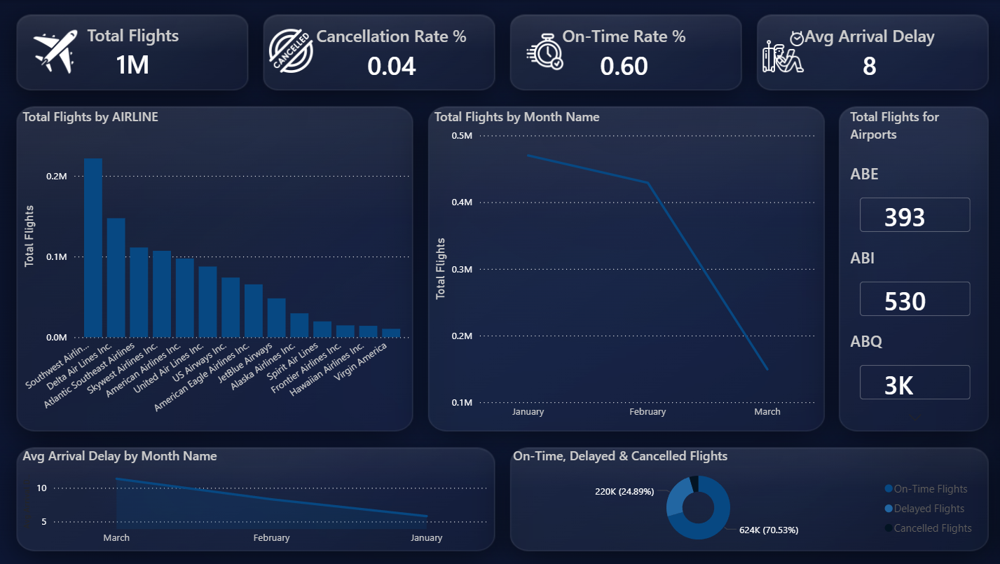
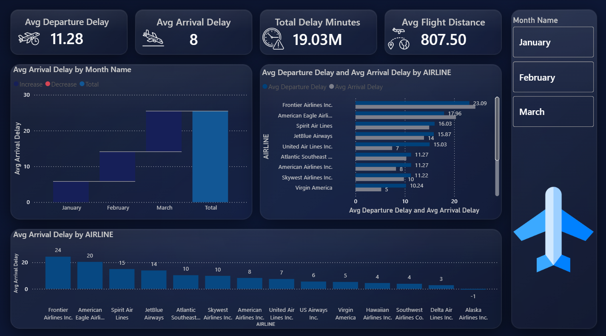
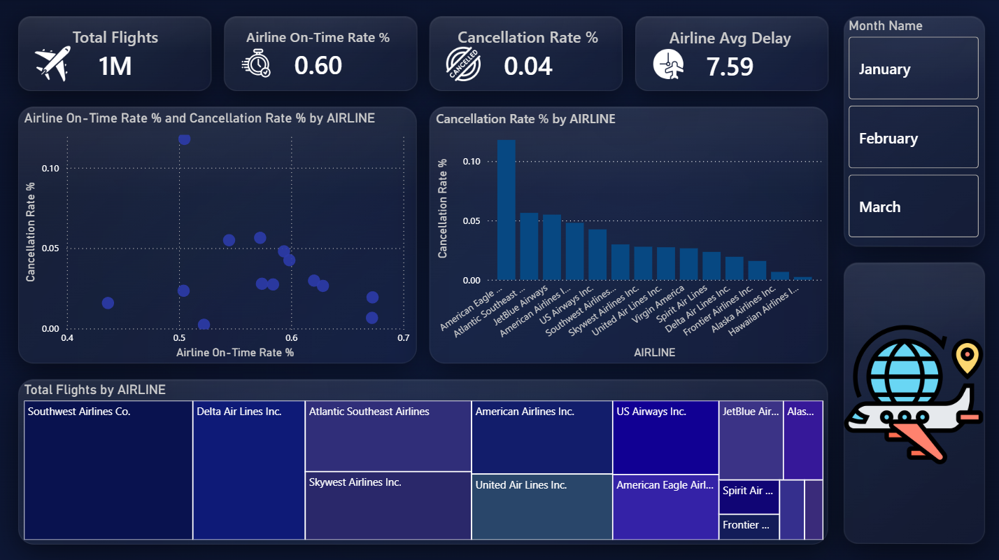
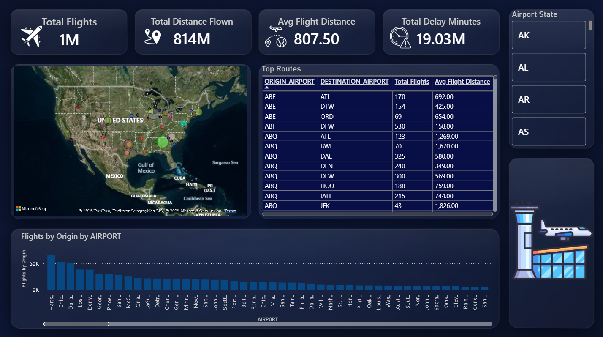

# U.S. Flight Operations in 2015 — Performance Dashboard

#### Table of Contents
- [Overview](#overview)
- [Key Metrics](#key-metrics)
- [Features](#features)
- [Data Sources](#data-sources)
- [Tools Used](#tools-used)
- [Dashboard Preview](#dashboard-preview)
- [Author](#author)

#### Overview
This Power BI dashboard provides a comprehensive analysis of U.S. domestic flight operations in 2015, covering over 1 million flights across 14 airlines and 300+ airports. The dashboard tracks flight performance, delay patterns, cancellations, and route activity across the United States.

#### Key Metrics
- Total Flights
- Cancellation Rate %
- On-Time Rate %
- Avg Arrival Delay
- Avg Departure Delay
- Total Delay Minutes
- Total Distance Flown
- Avg Flight Distance

#### Features
- **Overview Page** — High-level KPIs, flights by airline, monthly trends, and flight status breakdown
- **Delay Analysis Page** — Departure and arrival delay trends by month and airline, with waterfall and clustered bar charts
- **Airline Performance Page** — Scatter chart comparing on-time rate vs cancellation rate, treemap of total flights, and cancellation breakdown by airline
- **Airport & Routes Page** — Interactive map of U.S. airports, top routes table, and busiest airports by origin flights

#### Data Sources
| File | Description |
|---|---|
| `airlines.csv` | 14 U.S. airlines with IATA codes |
| `airports.csv` | 300+ U.S. airports with coordinates |
| `flights.csv` | 1M+ flight records for 2015 |

#### Tools Used
- Power BI Desktop
- DAX (Data Analysis Expressions)
- Power Query (M Language)
- Data Modeling & Relationships
- Data Visualization

**Overview**

---

**Delay Analysis**

---

**Airline Performance**

---

**Airport & Routes**

#### Author
> Mohamed Elgohary — [GitHub](https://github.com/Mohamed-Elgohary811) | [LinkedIn](https://www.linkedin.com/feed/)
